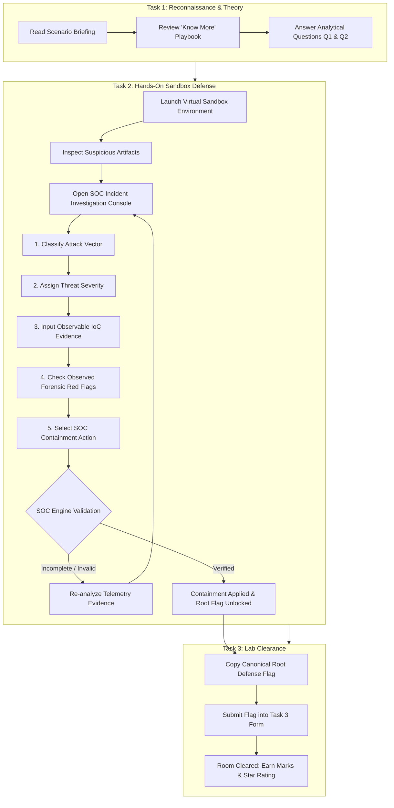

# Cyber Guardian — Hands-On Simulation & SOC Incident Response Guide

This document outlines the updated workflow, threat classification steps, and hands-on incident response procedures for the Cyber Guardian simulation labs.

---

## 1. Overview & Architecture Upgrade

### Key Changes
1. **Removal of Redundant In-Room Difficulty Switchers:**
   - Previous versions displayed an arbitrary `[EASY] [MEDIUM] [HARD]` toggle at the top of the room which conflicted with the scenario's predefined curriculum difficulty.
   - The lab header now displays the scenario's **Pre-Scheduled Level Badge** (`SCHEDULED LEVEL: BEGINNER | INTERMEDIATE | ADVANCED`), aligning directly with the curriculum defined in [`src/data/simulation/se-scenarios.ts`](src/data/simulation/se-scenarios.ts).

2. **Elimination of Instant / Auto-Displayed Flags:**
   - Single-click reporting and shortcut buttons (e.g., *"Claim Easy Flag"*) have been removed.
   - Flags are no longer awarded automatically upon clicking "Report". Students must perform a complete, realistic SOC investigation and submit validated Indicators of Compromise (IoCs).

3. **Unified Root Defense Flag Format:**
   - Arbitrary flag fragmentation (`FLAG{EASY_...}`, `FLAG{MED_...}`, `FLAG{HARD_...}`) has been replaced with a unified canonical flag:
     $$\mathbf{FLAG\{<SIM\_ID>\_<CATEGORY>\_DEFENDED\}}$$
     *(Example: `FLAG{SE-001_PHISHING_DEFENDED}`)*

---

## 2. End-to-End Simulation Steps



---

## 3. Detailed Step-by-Step Walkthrough

### Step 1: Scenario Reconnaissance & Guided Analysis (Task 1)
1. **Examine Threat Briefing:** Review the attack category, target environment, MITRE ATT&CK techniques, and threat actor motivation in the left-hand panel.
2. **Consult Defensive Playbook:** Expand the **"Practical Concept Guide"** or click **"Know More"** to inspect known Indicators of Compromise (IoCs), psychological triggers used, and defensive best practices.
3. **Submit Guided Questions:** Answer the scenario's analytical questions (e.g., identifying domain spoofing techniques or urgency vectors). Correct submissions contribute to the final lab score.

---

### Step 2: Hands-On Investigation in Sandbox (Task 2)
1. **Access the Target Sandbox:** Interact with the virtual machine / sandbox on the right panel (e.g., Email Client, Terminal, Corporate Chat, Browser, or Network Monitor).
2. **Forensic Inspection:** Analyze the incoming artifacts:
   - Check the **Sender Header & Return-Path** for domain homoglyphs (e.g., `paypa1.com`, `acmecorp-verify.com`).
   - Inspect hyperlinks without clicking (hover to reveal destination URL).
   - Check attachment extensions (e.g., double extensions like `.pdf.exe` or macro-enabled `.xlsm`).
   - Note coercive psychological triggers (fake deadlines, payment suspensions, impersonation).

> [!NOTE]
> **Strict Investigation Isolation:** Inspecting the sender details, checking SPF/DKIM records, or viewing headers are strictly classified as *investigative actions* (`isInvestigative: true`). They provide vital forensic clues but do **NOT** mark the incident as contained or reveal the Root Flag. The Root Flag is only awarded upon completing all 5 steps of the formal SOC containment report.

---

### Step 3: SOC Incident Investigation & Containment Report
To contain the threat and unlock the lab's Root Flag, click **"Investigate & Report Phishing"** (or the corresponding Incident Response action in the sandbox) to open the **SOC Incident Console**:

1. **Attack Vector Classification:**
   Select the specific attack type:
   - `Spear Phishing / Targeted Email`
   - `Domain Homoglyph / Typo-Squatting`
   - `Business Email Compromise (BEC)`
   - `Credential Harvesting Portal`
   - `Malicious File Attachment / Macro`
   - `Social Engineering / Pretexting`

2. **Threat Severity Assessment:**
   Evaluate the potential impact and assign the severity level:
   - `LOW` — Informational / unsolicited spam.
   - `MEDIUM` — Low-confidence probe / bulk phishing campaign.
   - `HIGH` — Targeted credential harvesting attempt.
   - `CRITICAL` — Active malware payload, zero-day exploit, or executive impersonation.

3. **Observable IoC Evidence (Mandatory):**
   Input the verified technical evidence observed in the sandbox:
   - Suspicious sender email or domain (e.g., `payroll-support@acmecorp-verify.com`).
   - Phishing URL or IP address (e.g., `https://secure-login.acmecorp-verify.com/login`).
   - Malicious file name or SHA-256 hash.

4. **Observed Forensic Red Flags:**
   Check all applicable forensic indicators discovered during investigation:
   - [x] Sender domain homoglyph / character substitution
   - [x] High-pressure coercive language or artificial deadline
   - [x] Masked URL pointing to unauthorized third-party host
   - [x] Unsolicited credential or MFA code request
   - [x] Suspicious executable or macro-enabled attachment

5. **SOC Containment Action:**
   Select the proper defensive mitigation to execute:
   - **Domain Sinkhole & Firewall Drop:** Blackhole domain on perimeter DNS and firewalls.
   - **Mailbox Purge (Global):** Revoke and purge message from all corporate mailboxes.
   - **Host Isolation & Quarantine:** Disconnect the target machine from the network.
   - **Token Revocation & Credential Reset:** Invalidate all active OAuth/SAML sessions.

---

### Step 4: Verification & Root Flag Unlock
1. Click **"Execute Containment & Submit Report"**.
2. The Cyber Guardian SOC engine validates the evidence:
   - If fields are missing, an alert prompts the student to complete full forensic documentation.
   - If validated, the threat is marked contained, system risk decreases, and the official **Root Defense Flag** is generated.
3. The confirmation window displays the verified flag:
   ```text
   FLAG{SE-001_PHISHING_DEFENDED}
   ```
4. Click **"Copy Flag & Proceed"**.

---

### Step 5: Room Clearance & Performance Grading (Task 3)
1. Navigate to **Task 3: Root Defense Flag** in the left panel.
2. Paste the copied Root Flag into the submission box and click **"Submit Flag"**.
3. **Grading & Scoring Breakdown:**
   - **Maximum Lab Score:** 200 Marks.
   - **Question Marks:** Awarded per correct question.
   - **Penalties:** -15 marks per incorrect flag or question attempt.
   - **Star Rating:**
     - ⭐⭐⭐ **3 Stars:** 180+ marks (Flawless defense, zero deductions).
     - ⭐⭐ **2 Stars:** 140–179 marks (Successful containment with minor deductions).
     - ⭐ **1 Star:** Under 140 marks (Room cleared with multiple retries).
4. Progress, badges, and defensive metrics are updated in your Cyber Guardian user profile.

---

## 4. Key Files & Components Reference

| File Path | Description |
|---|---|
| [`src/components/simulation/TryHackMeRoom.tsx`](src/components/simulation/TryHackMeRoom.tsx) | Cyber Range room controller, scheduled level badge, task questions, and flag verification engine. |
| [`src/components/simulation/IncidentReportModal.tsx`](src/components/simulation/IncidentReportModal.tsx) | SOC Incident Investigation & Threat Classification Console for student hands-on reporting. |
| [`src/components/simulation/EmailClient.tsx`](src/components/simulation/EmailClient.tsx) | Virtual email sandbox client with header analysis and SOC report launcher. |
| [`src/data/simulation/se-scenarios.ts`](src/data/simulation/se-scenarios.ts) | Definitive catalog of social engineering scenarios, scheduled difficulty tiers, and learning objectives. |
| [`src/store/simulation-store.ts`](src/store/simulation-store.ts) | Global telemetry event bus tracking defense actions (`REPORT_FILED`), risk level, and scoring. |
